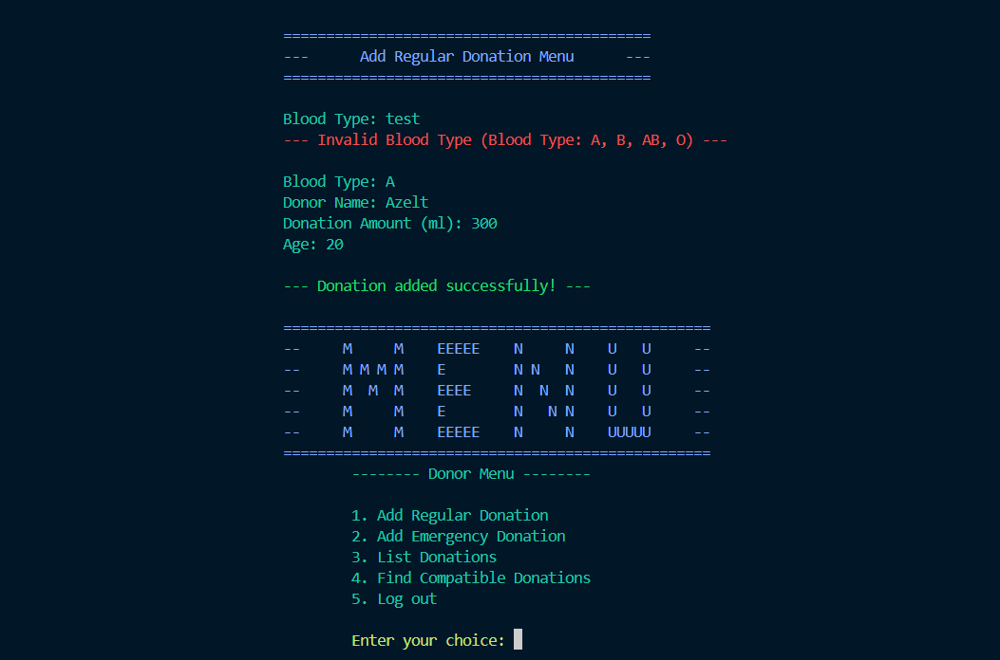

# 🩸 **Blood Bank Management System**  
[](https://www.oracle.com/java/)  
[](https://sdgs.un.org/goals/goal3)  

---

## 📜 **Project Overview**  
The **Blood Bank Management System** is a Java-based application designed to efficiently manage blood donations, ensure eligibility, and facilitate blood type compatibility searches, including regular and emergency contributions. It allows user to add, view, and search for compatible blood donations while ensuring robust validation and eligibility checks. By utilizing the principles of **Object-Oriented Programming (OOP)**, this system ensures modularity, scalability, and maintainability. The project addresses **Sustainable Development Goal (SDG) 3: Good Health and Well-Being**, enhancing healthcare through effective blood management.

Key functionalities include:  
- 📋 Secure donor account creation and login  
- 💉 Adding and managing **Regular** and **Emergency** donations  
- 🔍 Finding **compatible blood donations** based on blood type  
- 📜 Listing donations in a structured format  

[Learn more about SDG 3 here](https://sdgs.un.org/goals/goal3)  

---

## 🛠️ **Object-Oriented Programming Principles**  

### **1. Abstraction** 🌐  
- Centralized common attributes and behaviors in the abstract class `BloodDonation`.  
- Simplifies implementation by focusing on key features of the domain.
- Abstract class BloodDonation encapsulates common attributes (e.g., donor name, blood type) and methods.
- Subclasses (RegularDonation, EmergencyDonation) define specific behaviors.

### **2. Inheritance** 🧬  
- Specialized donation types (`RegularDonation` and `EmergencyDonation`) inherit from the `BloodDonation` base class.  
- Promotes **code reuse** and ensures extendability.

### **3. Polymorphism** 🔄  
- Abstract methods like `isEligibleToDonate()` are overridden in subclasses to define type-specific donation rules.  
- Enables the system to handle various donation types seamlessly.

### **4. Encapsulation** 🔐  
- Attributes such as `donorName` and `bloodType` are private and accessed through getter and setter methods.  
- Provides controlled access to critical data, ensuring security and integrity.

### **5. Interface Implementation** 🖇️  
- The `BloodBankOperations` interface defines operations like adding, listing, and finding donations.  
- Ensures modular and consistent system behavior.  

[Click here to explore OOP principles](https://en.wikipedia.org/wiki/Object-oriented_programming)  

---

## 🌍 **SDG 3: Good Health and Well-Being**  

This project supports **SDG 3** by:  
- Improving access to life-saving blood donations through structured management.  
- Reducing delays in critical blood supply during emergencies.  
- Ensuring safe donation practices through clear eligibility criteria.
- Facilitates safe and regulated blood donations, reducing risks in transfusions.
- Matches compatible blood donors with recipients swiftly, enhancing medical responses.
- Encourages regular and emergency donations through an organized system.

By connecting donors and recipients efficiently, this system helps address critical healthcare challenges globally. The project contributes to the health and well-being of the community by ensuring efficient blood management, which can save lives in emergencies and improve healthcare accessibility. By automating blood donation and distribution, the system improves the response time during medical emergencies and helps maintain an adequate blood supply. The system is scalable and can be adapted to hospitals or blood banks globally, supporting ongoing health initiatives and improving global healthcare infrastructure.

---

## 📐Instructions for Running the Blood Bank Management System

## 🛠️ System Requirements

1. **Java Development Kit (JDK)**:  
   - Ensure you have **JDK 8 or higher** installed.  
   - [Download JDK here](https://www.oracle.com/java/technologies/javase-downloads.html).  

2. **Integrated Development Environment (IDE)**:  
   - Use any IDE like **IntelliJ IDEA**, **Eclipse**, or **VS Code** with Java extensions.  

3. **Git (optional)**:  
   - Install Git if you plan to clone the repository directly.  
   - [Download Git here](https://git-scm.com/downloads).  

---

## 🚀 Steps to Run the Program

1. **Clone the Repository**:  
   Open your terminal or Git Bash and enter:  
   ```bash
   git clone https://github.com/your-username/blood-bank-management
   ```  
   Alternatively, download the repository as a ZIP file and extract it.  

2. **Open the Project in an IDE**:  
   - Launch your preferred IDE.  
   - Open the folder containing the project files.  

3. **Check Dependencies**:  
   - Ensure the `BloodBankManagementSystem` Java class and its supporting files are properly loaded.  
   - Verify that your IDE is configured to use the correct Java version (8 or higher).  

4. **Compile the Program**:  
   - Locate the `BloodBankManagementSystem` class in your IDE.  
   - Compile the code by clicking the **Run** or **Build** button in your IDE.  
   - If using the command line, navigate to the folder containing the `.java` files and execute:  
     ```bash
     javac BloodBankManagementSystem.java
     ```  

5. **Run the Program**:  
   - Execute the main class to start the program:  
     ```bash
     java BloodBankManagementSystem
     ```  
   - Follow the on-screen prompts to interact with the system.  

---
## 🔧 Troubleshooting Tips

- **Java Not Recognized**:  
   If you encounter an error like `java: command not found`, ensure the **JDK** is correctly installed and the `JAVA_HOME` environment variable is set.  

- **Compilation Errors**:  
   - Ensure all necessary `.java` files are in the same directory.  
   - Verify there are no typos or missing files.  

- **Blank Screen or Errors**:  
   - Restart your IDE and ensure all files are saved and compiled.  
   - Check the console for error messages and address them accordingly.  

---

## 1. **Donor Login Menu**
**Description:** Donors can enter their username and password to access the system. <br>
 &emsp; [1] Log In <br>
 &emsp; [2] Create New Account <br>
 &emsp; [3] Exit <br>


## 2. **Main Menu**
**Description:** The main menu provides options for donors to <br>
 &emsp; [1] Add Regular Donation <br>
 &emsp; [2] Add Emergency Donation <br>
 &emsp; [3] List Donation <br>
 &emsp; [4] Find Compatible Donations <br>
 &emsp; [5] Log Out <br>


---

## 3. **Add Regular Donation**
**Description:** The form to add regular donation includes donor name, blood type, age, and donation amount.



---

## 4. **List Donations**
**Description:** Displays the list of all recorded donations, categorized into regular and emergency donations. <br>
 &emsp; [1] View Regular Donations <br>
 &emsp; [2] View Emergency Donations <br>
 &emsp; [3] Return to Donor Menu <br>


---

## 5. **Find Compatible Donations**
**Description:** Shows compatible donations based on a specified blood type.


For further assistance, refer to the project repository’s [Issues](https://github.com/Azeltdz/Dela_Cruz_Final_Project_OOP_Blood_Bank_Management_System/issues) page or contact the developers.  

Happy coding! 🎉

### 📫 Connect with Me  
- 👤 [GitHub Profile](https://github.com/Azeltdz)
